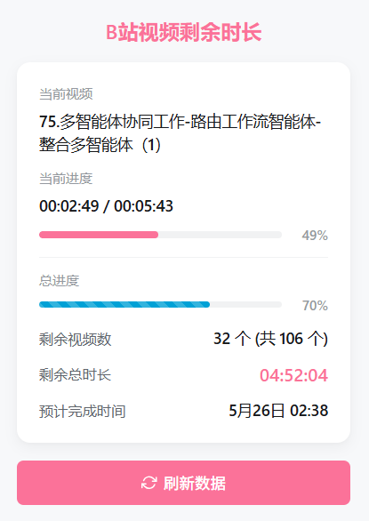

# B站视频剩余时长计算器

[](https://www.typescriptlang.org/)
[](https://vitejs.dev/)
[](https://developer.chrome.com/docs/extensions/mv3/)

Chrome/Edge 扩展：在 B 站合集/多集视频页面计算“从当前集开始到看完”的剩余总时长，并在弹窗中展示标题、进度、剩余集数、剩余总时长与预计完成时间。

> B站合集视频剩余时长计算器 —— 让学习进度一目了然

在B站学习时，最难受的是不知道这个合集**还剩多久才能看完**。

是再学半小时就结束，还是还有三小时？心里没数，很难规划学习进度。

这个扩展就是解决这个问题的：一键查看合集**剩余集数、总时长、预计完成时间**，让学习更有掌控感。



***

## 快速开始 (Quick Start)

无论是作为使用者还是开发者，想要体验本扩展，只需以下几步：

1. **安装依赖**
   ```bash
   npm install
   ```
2. **构建产物**
   ```bash
   npm run build
   ```
   构建完成后，项目根目录下会生成一个 `dist/` 目录，这就是扩展的最终产物。
3. **在浏览器中加载扩展**
   - 打开扩展管理页（Chrome：`chrome://extensions/`，Edge：`edge://extensions/`）
   - 开启右上角\*\*“开发者模式”\*\*
   - 点击\*\*“加载已解压的扩展程序”\*\*，选择刚刚生成的 `dist/` 目录
   - 安装完成后，工具栏会出现本扩展的图标

***

## 使用者指南

### 功能特性

- **剩余总时长计算** — 自动解析合集/多集视频列表，计算从当前集起看完所需的总时长
- **实时进度展示** — 显示当前视频标题、当前播放进度、剩余未看集数
- **预计完成时间** — 基于当前时间 + 剩余时长，推算出看完所有剩余视频的预计时刻
- **一键刷新** — 切换视频集数或进度发生较大变化后，点击即可重新获取最新数据

### 已知限制

- **支持范围**：目前主要支持 B 站标准合集/多集视频（URL 匹配 `bilibili.com/video/*`）。番剧（`bangumi`）、课程、稍后再看及部分特殊播放页可能无法准确解析。
- **运行条件**：仅在 B 站视频页生效；在非视频页点击会提示“请在B站视频页面使用此扩展”。
- **数据来源**：计算基于当前页面 DOM 元素解析出的视频列表与时长信息，非 B 站内部 API。
- **网络与状态异常**：如果遇到页面未完全加载、网络异常或 B 站页面结构发生变更，可能导致时长计算不准或显示为空白，请尝试**刷新页面**后重试。

### 常见问题 (FAQ)

**Q：为什么弹窗显示空白或“未获取到数据”？**
A：请确保当前处于 B 站视频播放页且页面已加载完毕。如果页面刚刷新，请等待几秒钟再点击扩展图标。

**Q：计算的时间不准怎么办？**
A：计算基于页面加载时的时长信息。如果你已经播放了一部分，可以点击弹窗中的“刷新数据”按钮来更新计算结果。

**Q：有更新日志吗？**
A：详见 CHANGELOG.md（占位，待补充）。

***

## 开发者指南

### 技术栈

- **构建工具**：Vite
- **语言**：TypeScript, React
- **扩展规范**：Chrome Extension Manifest V3

### 项目结构

```text
├── app/                  # React 弹窗 UI 应用
│   ├── src/popup/        # Popup 页面源码
│   └── index.html        # Popup 入口 HTML
├── extension/            # 浏览器扩展核心逻辑
│   ├── background.ts     # Service Worker (后台脚本)
│   └── content.ts        # Content Script (内容脚本，注入页面)
├── scripts/              # 构建与校验脚本
├── images/               # 扩展图标资源
├── docs/                 # 开发文档 (包含迁移报告等)
├── manifest.json         # 扩展配置文件 (MV3)
└── vite.config.ts        # Vite 构建配置
```

### 架构简述

- **Content Script (`content.ts`)**：被注入到 `bilibili.com/video/*` 页面，负责解析 DOM 获取视频列表、当前集数及各集时长。
- **Popup (`app/src/popup/`)**：用户点击扩展图标时弹出的 React UI。
- **Background (`background.ts`)**：Service Worker，负责协调各部分并在后台维持扩展生命周期。
- **通信机制**：Popup 通过 Chrome Message API 与 Content Script 通信，请求最新的时长计算数据。

### 开发调试流程

#### 1. 开发（调试弹窗 UI）

```bash
npm run dev
```

启动后在浏览器打开 Vite 提供的本地服务器地址，并访问 `popup.html`（例如 `http://localhost:5173/popup.html`），即可在浏览器外独立调试 React UI 组件与样式。

#### 2. 调试 Content Script / Background

若需要调试页面注入逻辑：

1. 先执行 `npm run build`
2. 在浏览器中加载 `dist/` 目录
3. 打开 B 站视频页，打开网页的开发者工具 (DevTools) 即可调试 Content Script；
4. 在扩展管理页点击“Service Worker”即可调试 Background 脚本。
   *(注：扩展内容脚本暂不支持 Vite HMR 热更新，修改代码后需重新 build 并刷新扩展与页面)*

### 校验与贡献

当你准备提交代码前，建议运行此命令以确保产物无误：

```bash
npm run verify
```

该命令会依次执行：TypeScript 类型检查 -> Vite 构建 -> `dist/` 结构与文件完整性校验。

1. Fork 本仓库并基于 `main` 分支拉取新分支
2. 遵循现有的代码规范（TypeScript + React）
3. 提交前确保运行 `npm run verify` 无报错
4. 提交 Pull Request，并在描述中说明改动点
5. 迁移报告详见 [docs/migration-report.md](docs/migration-report.md)

***

## 隐私说明

本扩展注重用户隐私与数据安全：

- **不请求任何额外网络权限**，也不收集、上传或与第三方共享任何个人数据。
- **不访问非 B站页面**，所有功能仅在匹配 `*://*.bilibili.com/video/*` 时生效。
- **申请的权限解释**：
  - `activeTab`：仅在用户主动点击扩展图标时，获取当前标签页权限以执行脚本。
  - `*://*.bilibili.com/*`：用于在 B 站域名下注入脚本以读取视频时长。

***

## 开源协议

[MIT License](./LICENSE)
